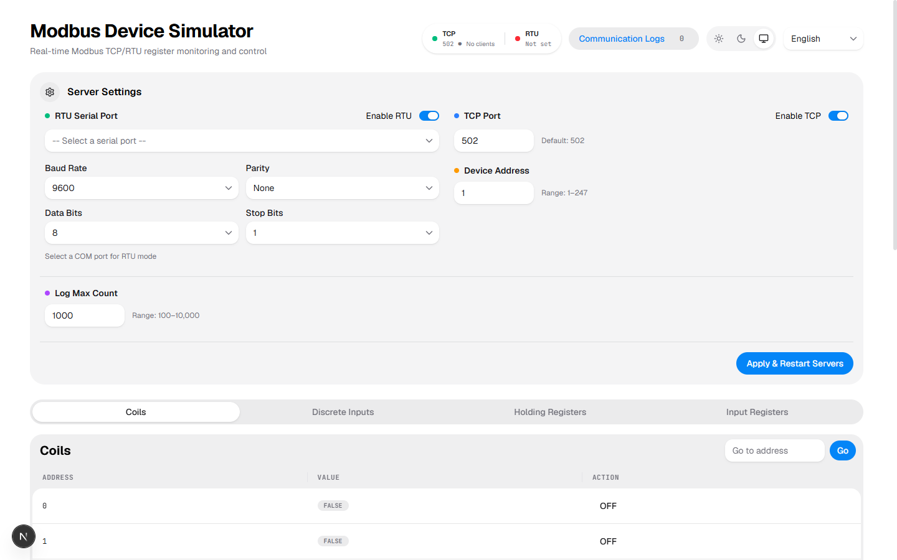

<div align="center">

# Simulateur de périphérique Modbus

<p>
  <a href="../README.md">English</a> |
  <a href="README_CN.md">中文</a> |
  <a href="README_JA.md">日本語</a>
</p>

Un simulateur de périphérique Modbus TCP / RTU série gratuit avec un tableau de bord Web en temps réel.

> **Vibe Coding** — Ce projet est principalement construit grâce au développement rapide assisté par IA.

[](https://nextjs.org/)
[](https://react.dev/)
[](https://www.typescriptlang.org/)
[](https://tailwindcss.com/)
[](LICENSE)

</div>

---

## Aperçu

**Modbus Device Simulator** est un simulateur de périphérique Modbus full-stack construit avec des technologies Web modernes. Il exécute à la fois un **serveur Modbus TCP** et un **serveur série RTU**, pilotés par un moteur d'état singleton haute performance, et expose un tableau de bord Web en temps réel pour surveiller et contrôler les registres, consulter les journaux de communication et configurer les paramètres du serveur.

Que vous développiez des applications client Modbus, testiez des intégrations PLC ou appreniez le protocole Modbus, ce simulateur fournit une solution légère sans matériel.

## Fonctionnalités

- **Prise en charge double protocole**
  - **Serveur Modbus TCP** — Port configurable (par défaut 502) avec suivi des clients actifs
  - **Serveur série Modbus RTU** — Intégration port série réel avec débit en bauds, parité, bits de données et bits d'arrêt configurables
- **Couverture complète des registres**
  - 1 000 Coils (booléens lecture/écriture)
  - 1 000 Entrées discrètes (booléens lecture seule)
  - 10 000 Registres de maintien (16 bits lecture/écriture)
  - 10 000 Registres d'entrée (16 bits lecture seule)
- **Tableau de bord en temps réel**
  - Tables de registres en direct avec pagination et saut d'adresse
  - Basculer les coils et écrire les valeurs des registres de maintien/d'entrée directement depuis l'interface
  - **Écriture avancée de registres** — Écrire des valeurs multi-registres à l'aide de formats de données typés (UInt8, Int16BE, FloatBE, DoubleLE, etc.) ou de chaînes d'octets hexadécimales brutes
  - Journaux de communication en ordre chronologique inverse (le plus récent en premier)
  - Filtrage configurable des journaux (lecture / écriture / erreur / connexion)
  - État du serveur, clients TCP actifs et panneau de configuration
- **Journalisation des communications**
  - Tampon de journaux en mémoire avec nombre maximal configurable (100–10 000 entrées)
  - Suivi des requêtes, réponses, erreurs et connexions TCP
  - Annotation de la source pour chaque entrée de journal (TCP, série ou Web)
- **Internationalisation**
  - Anglais, Chinois (中文), Français et Japonais (日本語)
- **Prise en charge des thèmes**
  - Modes Clair / Sombre / Système
- **API REST**
  - API HTTP complète pour l'intégration externe et l'automatisation, incluant les écritures de registres par lots

### Tableau de bord Web



## Stack technique

| Couche          | Technologie                                                             |
| --------------- | ----------------------------------------------------------------------- |
| Framework       | [Next.js](https://nextjs.org/) 16 (App Router)                          |
| Bibliothèque UI | [React](https://react.dev/) 19                                          |
| Composants      | [HeroUI](https://www.heroui.com/) v3                                    |
| Style           | [Tailwind CSS](https://tailwindcss.com/) v4                             |
| Langage         | [TypeScript](https://www.typescriptlang.org/)                           |
| Modbus TCP      | [modbus-serial](https://github.com/yaacov/node-modbus-serial)           |
| Modbus RTU      | [serialport](https://serialport.io/) + analyseur de trames personnalisé |
| Tests           | [Vitest](https://vitest.dev/) + [Playwright](https://playwright.dev/)   |
| Icônes          | [Iconify](https://iconify.design/) (Lucide)                             |
| Animation       | [Framer Motion](https://www.framer.com/motion/)                         |

## Démarrage rapide

### Exécution avec NPX (sans installation)

Le moyen le plus rapide de commencer — aucun clonage ni installation requis :

```bash
npx @ruixe/modbus-simulator@latest
```

Avec options :

```bash
npx @ruixe/modbus-simulator@latest -p 8080 -t 5020 -o
```

Voir toutes les options disponibles :

```bash
npx @ruixe/modbus-simulator@latest --help
```

### Prérequis

- [Node.js](https://nodejs.org/) 20.6 ou ultérieur
- [npm](https://www.npmjs.com/) ou [pnpm](https://pnpm.io/)

### Installation (Développement)

```bash
# Cloner le dépôt
git clone https://github.com/RuixeWolf/modbus-simulator.git
cd modbus-simulator

# Installer les dépendances
npm install
# ou
pnpm install
```

### Développement

```bash
# Démarrer le serveur de développement (port par défaut 5000)
npm run dev
```

Ouvrez [http://localhost:5000](http://localhost:5000) dans votre navigateur.

Le serveur Modbus TCP démarre automatiquement sur le port `502` (ou selon la configuration). Le serveur série RTU ne démarre que lorsqu'un chemin de port série est configuré.

### Build de production

```bash
# Build pour la production
npm run build

# Démarrer le serveur de production
npm start
```

## Configuration

Créez un fichier `.env.local` à la racine du projet pour personnaliser les paramètres :

```bash
# Port du serveur de développement Next.js (par défaut 5000)
PORT=5000

# Port Modbus TCP (utilisé en production ; le serveur de dev démarre toujours TCP sur 502)
MODBUS_TCP_PORT=502
```

Les paramètres peuvent aussi être modifiés via le tableau de bord ou le point de terminaison authentifié `/api/v1/config`. Les écouteurs HTTP et Modbus TCP utilisent `127.0.0.1` par défaut ; configurez `MODBUS_API_TOKEN` (ou `--api-token-file`) avant toute écoute hors boucle locale.

## Utilisation

### Tableau de bord Web

1. Ouvrez le tableau de bord à l'adresse `http://localhost:5000`
2. **Registres** — Affichez tous les coils, entrées discrètes, registres de maintien et registres d'entrée. Basculez les coils ou modifiez les valeurs des registres directement. Utilisez **Écriture avancée** pour des valeurs multi-registres typées ou des octets hexadécimaux bruts.
3. **Journaux** — Surveillez toutes les communications Modbus en temps réel. Filtrez par type de journal et effacez les journaux selon les besoins.
4. **Paramètres** — Configurez le port TCP, l'ID esclave, le chemin du port série RTU, les paramètres série, le filtre de journaux et le nombre maximal de journaux. Les modifications prennent effet immédiatement après le redémarrage des serveurs.

### Connexion avec un client Modbus

**Modbus TCP (avec [modbus-serial](https://github.com/yaacov/node-modbus-serial)) :**

```javascript
const { ModbusTCP } = require('modbus-serial')
const client = new ModbusTCP()
await client.connectTCP('127.0.0.1', { port: 502 })

// Lire les registres de maintien
const data = await client.readHoldingRegisters(0, 10)
console.log(data.data)

// Écrire un coil
await client.writeCoil(0, true)

client.close()
```

**Modbus RTU (port série) :**

Configurez le chemin du port série RTU (par exemple `COM3` sur Windows, `/dev/ttyUSB0` sur Linux) dans les paramètres du tableau de bord, puis connectez-vous avec n'importe quel client Modbus RTU standard.

## Automatisation et API v1

La version 1.1.0 fournit une API de contrôle stricte et versionnée. Lancez une instance locale isolée et attendez son état de santé réel :

```bash
npx --yes @ruixe/modbus-simulator@latest --host 127.0.0.1 --port 15000 --tcp-host 127.0.0.1 --tcp-port 15020 --ready-output json --ready-timeout 30 --strict-ready
```

La découverte publique est disponible via `GET /api/v1` et `GET /api/v1/openapi.json`. Les autres routes v1 couvrent la santé, l'état et sa réinitialisation, les plages de registres, les écritures typées/hexadécimales, la configuration, les journaux par curseur, les ports série et les clients TCP. Les succès utilisent `{ "data": ..., "meta": ... }` et les erreurs `{ "error": { "code", "message", "issues"? }, "meta": ... }`.

Avec un Token configuré, envoyez `Authorization: Bearer <token>`. Les adresses commencent à 0, les écritures de plage sont atomiques et limitées à 1 000 valeurs. Consultez le [guide de migration 1.1](MIGRATION_1.1.md) et l'[Agent Skill](../skills/modbus-simulator/SKILL.md).

## Structure du projet

```
modbus-simulator/
├── app/
│   ├── api/v1/                 # API de contrôle versionnée + OpenAPI
│   ├── globals.css             # Entrée Tailwind CSS v4 + variables de thème
│   ├── layout.tsx              # Layout racine avec i18n & thème
│   └── page.tsx                # Page tableau de bord (composant client)
├── src/
│   ├── components/
│   │   ├── AdvancedWriteModal.tsx   # Modale d'écriture avancée multi-registres
│   │   ├── LanguageSwitcher.tsx     # Sélecteur de langue
│   │   ├── LogPanel.tsx             # Panneau de journaux de communication
│   │   ├── RegisterTable.tsx        # Table de registres paginée
│   │   ├── SettingsPanel.tsx        # Panneau de paramètres du serveur
│   │   ├── StatusIndicator.tsx      # Indicateur d'état du serveur
│   │   ├── TcpClientPanel.tsx       # Liste des clients TCP actifs
│   │   └── ThemeToggle.tsx          # Bascule de thème clair/sombre/système
│   ├── hooks/
│   │   ├── useModbusData.ts    # Hook React pour le polling des données Modbus
│   │   └── useTheme.ts         # Gestion du thème (clair/sombre/système)
│   ├── i18n/
│   │   └── index.ts            # Initialisation i18next (EN / CN / FR / JA)
│   ├── lib/
│   │   └── modbus/
│   │       ├── buffer-convert.ts     # Conversions type de données ↔ buffer
│   │       ├── engine.ts             # ModbusEngine singleton (état + événements)
│   │       ├── engine.test.ts        # Tests unitaires du moteur
│   │       ├── index.ts              # Gestionnaire de serveurs (démarrage/arrêt/config)
│   │       ├── log-context.ts        # AsyncLocalStorage pour le contexte de source de journal
│   │       ├── mock-client.ts        # Client simulé pour les tests E2E
│   │       ├── rtu-serial-server.ts  # Serveur série Modbus RTU
│   │       └── tcp-server.ts         # Serveur Modbus TCP
│   └── types/
│       └── modbus-serial.d.ts  # Déclarations de types personnalisées
├── docs/                       # Documentation et captures d'écran
├── e2e/                        # Tests E2E Playwright
├── public/locales/             # Fichiers JSON de traduction (en, zh, fr, ja)
├── next.config.ts
├── vitest.config.ts
├── playwright.config.ts
└── package.json
```

## Tests

```bash
# Exécuter les tests unitaires (Vitest)
npm run test:unit

# Exécuter les tests E2E (Playwright)
npm run test:e2e

# Exécuter tous les tests
npm run test

# Exécuter un fichier de test unitaire spécifique
npx vitest run src/lib/modbus/engine.test.ts

# Exécuter un test E2E spécifique
npx playwright test e2e/modbus.spec.ts --grep "UI to Protocol"
```

## Scripts disponibles

| Script               | Description                                                 |
| -------------------- | ----------------------------------------------------------- |
| `npm run dev`        | Démarrer le serveur de développement (port par défaut 5000) |
| `npm run build`      | Build de production                                         |
| `npm run start`      | Démarrer le serveur de production                           |
| `npm run lint`       | Exécuter ESLint                                             |
| `npm run format`     | Formater tous les fichiers avec Prettier                    |
| `npm run type-check` | Exécuter le compilateur TypeScript (sans émission)          |
| `npm run test:unit`  | Exécuter les tests unitaires Vitest                         |
| `npm run test:e2e`   | Exécuter les tests E2E Playwright                           |
| `npm run test`       | Exécuter les tests unitaires puis les tests E2E             |

## Licence

[MIT](LICENSE)
