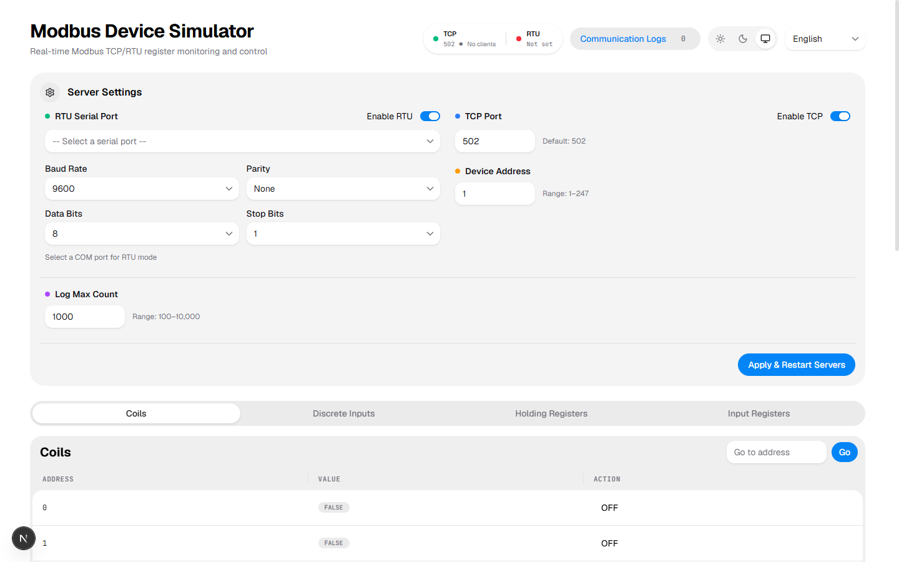

<div align="center">

# Modbus デバイスシミュレータ

<p>
  <a href="../README.md">English</a> |
  <a href="README_CN.md">中文</a> |
  <a href="README_FR.md">Français</a>
</p>

リアルタイム Web ダッシュボード付きの無料 Modbus TCP / RTU シリアル デバイスシミュレータ。

> **Vibe Coding** — 本プロジェクトは主に AI 支援による迅速な開発で構築されています。

[](https://nextjs.org/)
[](https://react.dev/)
[](https://www.typescriptlang.org/)
[](https://tailwindcss.com/)
[](LICENSE)

</div>

---

## 概要

**Modbus Device Simulator** は、最新の Web 技術で構築されたフルスタックの Modbus デバイスシミュレータです。**Modbus TCP サーバー**と **RTU シリアルサーバー**の両方を実行し、高性能なシングルトン状態エンジンによって駆動され、リアルタイムの Web ダッシュボードを通じてレジスタの監視・制御、通信ログの閲覧、サーバー設定の管理などを行うことができます。

Modbus クライアントアプリケーションの開発、PLC 統合のテスト、Modbus プロトコルの学習など、本シミュレータはハードウェアを必要としない軽量なソリューションを提供します。

## 機能

- **デュアルプロトコル対応**
  - **Modbus TCP サーバー** — ポート設定可能（デフォルト 502）、アクティブなクライアント追跡機能付き
  - **Modbus RTU シリアルサーバー** — 実際のシリアルポート統合、ボーレート、パリティ、データビット、ストップビットを設定可能
- **完全なレジスタカバレッジ**
  - 1,000 コイル（読み書き可能なブール値）
  - 1,000 ディスクリート入力（読み取り専用ブール値）
  - 10,000 ホールディングレジスタ（読み書き可能な 16 ビット値）
  - 10,000 入力レジスタ（読み取り専用 16 ビット値）
- **リアルタイムダッシュボード**
  - ページネーションとアドレスジャンプ機能付きのライブレジスタテーブル
  - UI から直接コイルの切り替えやホールディング/入力レジスタ値の書き込み
  - **高度なレジスタ書き込み** — 型付きデータフォーマット（UInt8、Int16BE、FloatBE、DoubleLE など）または生の 16 進数バイト列を使用した複数レジスタ書き込み
  - 逆時系列の通信ログ（最新が先頭）
  - 設定可能なログフィルタリング（読み取り / 書き込み / エラー / 接続）
  - サーバー状態、アクティブな TCP クライアント、設定パネル
- **通信ログ**
  - 設定可能な最大数（100～10,000 エントリ）のメモリ内ログバッファ
  - リクエスト、レスポンス、エラー、TCP 接続の追跡
  - エントリごとのログソース注釈（TCP、シリアル、Web）
- **国際化対応**
  - 英語、中国語（中文）、フランス語、日本語
- **テーマ対応**
  - ライト / ダーク / システム テーマモード
- **REST API**
  - 外部統合と自動化用の完全な HTTP API、バッチレジスタ書き込みを含む

### Web ダッシュボード



## 技術スタック

| レイヤー       | テクノロジー                                                          |
| -------------- | --------------------------------------------------------------------- |
| フレームワーク | [Next.js](https://nextjs.org/) 16（App Router）                       |
| UI ライブラリ  | [React](https://react.dev/) 19                                        |
| コンポーネント | [HeroUI](https://www.heroui.com/) v3                                  |
| スタイリング   | [Tailwind CSS](https://tailwindcss.com/) v4                           |
| 言語           | [TypeScript](https://www.typescriptlang.org/)                         |
| Modbus TCP     | [modbus-serial](https://github.com/yaacov/node-modbus-serial)         |
| Modbus RTU     | [serialport](https://serialport.io/) + カスタムフレームパーサー       |
| テスト         | [Vitest](https://vitest.dev/) + [Playwright](https://playwright.dev/) |
| アイコン       | [Iconify](https://iconify.design/)（Lucide）                          |
| アニメーション | [Framer Motion](https://www.framer.com/motion/)                       |

## クイックスタート

### NPX で実行（インストール不要）

最も速い方法 — クローンやインストールは不要です：

```bash
npx @ruixe/modbus-simulator@latest
```

オプション付き：

```bash
npx @ruixe/modbus-simulator@latest -p 8080 -t 5020 -o
```

すべての利用可能なオプションを表示：

```bash
npx @ruixe/modbus-simulator@latest --help
```

### 前提条件

- [Node.js](https://nodejs.org/) 20.6 以降
- [npm](https://www.npmjs.com/) または [pnpm](https://pnpm.io/)

### インストール（開発用）

```bash
# リポジトリをクローン
git clone https://github.com/RuixeWolf/modbus-simulator.git
cd modbus-simulator

# 依存関係をインストール
npm install
# または
pnpm install
```

### 開発

```bash
# 開発サーバーを起動（デフォルトポート 5000）
npm run dev
```

ブラウザで [http://localhost:5000](http://localhost:5000) を開きます。

Modbus TCP サーバーはポート `502`（または設定したポート）で自動的に起動します。RTU シリアルサーバーはシリアルポートパスが設定された場合のみ起動します。

### 本番ビルド

```bash
# 本番用にビルド
npm run build

# 本番サーバーを起動
npm start
```

## 設定

プロジェクトのルートに `.env.local` ファイルを作成して設定をカスタマイズします：

```bash
# Next.js 開発サーバーポート（デフォルトは 5000）
PORT=5000

# Modbus TCP ポート（本番環境で使用；開発サーバーは常に 502 で TCP を起動）
MODBUS_TCP_PORT=502
```

サーバー設定（TCP ポート、スレーブ ID、RTU シリアルパス、ボーレート、パリティ、ログフィルタ、ログ最大数など）は、Web ダッシュボードまたは `/api/config` エンドポイントを介して実行時に変更することもできます。

## 使い方

### Web ダッシュボード

1. `http://localhost:5000` でダッシュボードを開きます
2. **レジスタ** — すべてのコイル、ディスクリート入力、ホールディングレジスタ、入力レジスタを表示します。コイルを直接切り替えたり、レジスタ値を編集したりできます。**高度な書き込み** を使用して、型付きの複数レジスタ値または生の 16 進数バイトを書き込みます。
3. **ログ** — すべての Modbus 通信をリアルタイムで監視します。ログタイプでフィルタリングし、必要に応じてログをクリアします。
4. **設定** — TCP ポート、スレーブ ID、RTU シリアルポートパス、シリアルパラメータ、ログフィルタ、ログ最大数を設定します。変更はサーバーの再起動後すぐに有効になります。

### Modbus クライアントで接続

**Modbus TCP（[modbus-serial](https://github.com/yaacov/node-modbus-serial) を使用）：**

```javascript
const { ModbusTCP } = require('modbus-serial')
const client = new ModbusTCP()
await client.connectTCP('127.0.0.1', { port: 502 })

// ホールディングレジスタを読み取り
const data = await client.readHoldingRegisters(0, 10)
console.log(data.data)

// コイルを書き込み
await client.writeCoil(0, true)

client.close()
```

**Modbus RTU（シリアルポート）：**

ダッシュボードの設定で RTU シリアルパス（例：Windows では `COM3`、Linux では `/dev/ttyUSB0`）を設定し、標準の Modbus RTU クライアントで接続します。

## API リファレンス

すべての API ルートは `/api` でプリフィックスされ、開発サーバーが実行中である必要があります。

| メソッド | エンドポイント         | 説明                                                                                                                                             |
| -------- | ---------------------- | ------------------------------------------------------------------------------------------------------------------------------------------------ |
| GET      | `/api/registers`       | 完全な Modbus エンジン状態を取得                                                                                                                 |
| POST     | `/api/registers`       | コイルまたはレジスタを書き込み。本文：`{ registerType, address, value }`                                                                         |
| POST     | `/api/registers/batch` | レジスタをバッチ書き込み。本文：`{ registerType, startAddress, mode, dataType, value }` または `{ registerType, startAddress, mode, hexString }` |
| GET      | `/api/logs`            | すべての通信ログを取得                                                                                                                           |
| DELETE   | `/api/logs`            | すべての通信ログをクリア                                                                                                                         |
| GET      | `/api/status`          | サーバー状態：`{ tcp: boolean, rtu: boolean }`                                                                                                   |
| GET      | `/api/config`          | 現在の設定を取得（`logFilter` と `logMaxCount` を含む）                                                                                          |
| POST     | `/api/config`          | 設定を更新しサーバーを再起動。本文：部分的な設定オブジェクト                                                                                     |
| GET      | `/api/serial-ports`    | 利用可能なシリアルポートを一覧表示                                                                                                               |
| GET      | `/api/tcp-clients`     | アクティブな TCP クライアント接続を一覧表示                                                                                                      |
| GET      | `/api/tcp-clients/:id` | 特定の TCP クライアントの詳細を取得                                                                                                              |

### バッチ書き込み API

バッチ書き込みエンドポイントは 2 つのモードをサポートしています：

**数値モード** — 数値を型付きデータフォーマットを使用してレジスタに変換：

```bash
curl -X POST http://localhost:5000/api/registers/batch \
  -H "Content-Type: application/json" \
  -d '{
    "registerType": "holdingRegister",
    "startAddress": 0,
    "mode": "number",
    "dataType": "FloatBE",
    "value": 3.14
  }'
```

サポートされるデータ型：`UInt8`、`UInt16BE`、`UInt16LE`、`UInt32BE`、`UInt32LE`、`UIntBE`、`UIntLE`、`Int8`、`Int16BE`、`Int16LE`、`Int32BE`、`Int32LE`、`IntBE`、`IntLE`、`FloatBE`、`FloatLE`、`Float1234`、`Float2143`、`Float3412`、`Float4321`、`DoubleBE`、`DoubleLE`。

**バイトモード** — 16 進数文字列から生のバイトを書き込み：

```bash
curl -X POST http://localhost:5000/api/registers/batch \
  -H "Content-Type: application/json" \
  -d '{
    "registerType": "holdingRegister",
    "startAddress": 10,
    "mode": "bytes",
    "hexString": "0A 45 B1 30"
  }'
```

## プロジェクト構造

```
modbus-simulator/
├── app/
│   ├── api/                    # Next.js API ルート
│   │   ├── config/route.ts
│   │   ├── logs/route.ts
│   │   ├── registers/route.ts
│   │   ├── registers/batch/route.ts
│   │   ├── serial-ports/route.ts
│   │   ├── status/route.ts
│   │   ├── tcp-clients/route.ts
│   │   └── tcp-clients/[id]/route.ts
│   ├── globals.css             # Tailwind CSS v4 エントリ + テーマ変数
│   ├── layout.tsx              # i18n & テーマ付きルートレイアウト
│   └── page.tsx                # ダッシュボードページ（クライアントコンポーネント）
├── src/
│   ├── components/
│   │   ├── AdvancedWriteModal.tsx   # 高度な複数レジスタ書き込みモーダル
│   │   ├── LanguageSwitcher.tsx     # 言語切り替え
│   │   ├── LogPanel.tsx             # 通信ログパネル
│   │   ├── RegisterTable.tsx        # ページネーション付きレジスタテーブル
│   │   ├── SettingsPanel.tsx        # サーバー設定パネル
│   │   ├── StatusIndicator.tsx      # サーバー状態インジケーター
│   │   ├── TcpClientPanel.tsx       # アクティブな TCP クライアントリスト
│   │   └── ThemeToggle.tsx          # ライト/ダーク/システム テーマ切り替え
│   ├── hooks/
│   │   ├── useModbusData.ts    # Modbus データポーリング用 React Hook
│   │   └── useTheme.ts         # テーマ（ライト/ダーク/システム）管理
│   ├── i18n/
│   │   └── index.ts            # i18next 初期化（EN / CN / FR / JA）
│   ├── lib/
│   │   └── modbus/
│   │       ├── buffer-convert.ts     # 型付きデータ型 ↔ バッファ変換
│   │       ├── engine.ts             # シングルトン ModbusEngine（状態 + イベント）
│   │       ├── engine.test.ts        # エンジンの単体テスト
│   │       ├── index.ts              # サーバーマネージャー（起動/停止/設定）
│   │       ├── log-context.ts        # ログソースコンテキスト用 AsyncLocalStorage
│   │       ├── mock-client.ts        # E2E テスト用モッククライアント
│   │       ├── rtu-serial-server.ts  # Modbus RTU シリアルサーバー
│   │       └── tcp-server.ts         # Modbus TCP サーバー
│   └── types/
│       └── modbus-serial.d.ts  # カスタム型宣言
├── docs/                       # ドキュメントとスクリーンショット
├── e2e/                        # Playwright E2E テスト
├── public/locales/             # 翻訳 JSON ファイル（en、zh、fr、ja）
├── next.config.ts
├── vitest.config.ts
├── playwright.config.ts
└── package.json
```

## テスト

```bash
# 単体テストを実行（Vitest）
npm run test:unit

# E2E テストを実行（Playwright）
npm run test:e2e

# すべてのテストを実行
npm run test

# 特定の単体テストファイルを実行
npx vitest run src/lib/modbus/engine.test.ts

# 特定の E2E テストを実行
npx playwright test e2e/modbus.spec.ts --grep "UI to Protocol"
```

## 利用可能なスクリプト

| スクリプト           | 説明                                        |
| -------------------- | ------------------------------------------- |
| `npm run dev`        | 開発サーバーを起動（デフォルトポート 5000） |
| `npm run build`      | 本番ビルド                                  |
| `npm run start`      | 本番サーバーを起動                          |
| `npm run lint`       | ESLint を実行                               |
| `npm run format`     | Prettier ですべてのファイルをフォーマット   |
| `npm run type-check` | TypeScript コンパイラーを実行（出力なし）   |
| `npm run test:unit`  | Vitest 単体テストを実行                     |
| `npm run test:e2e`   | Playwright E2E テストを実行                 |
| `npm run test`       | 単体テストの後に E2E テストを実行           |

## ライセンス

[MIT](LICENSE)
